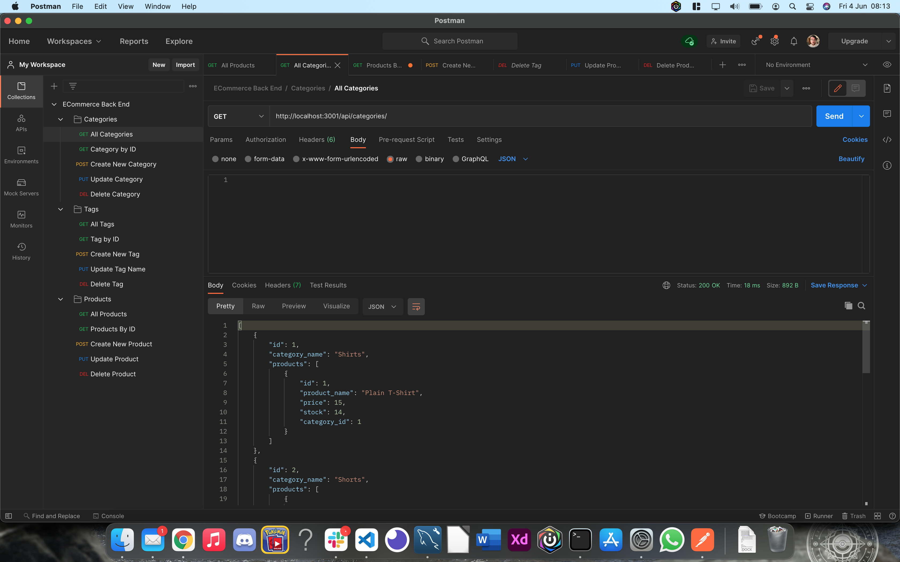

# E-Commerce Back End


## Table of Contents

- [E-Commerce Back End](#e-commerce-back-end)
  - [Table of Contents](#table-of-contents)
  - [Description](#description)
  - [Installation](#installation)
  - [Usage](#usage)
  - [Licence](#licence)
  - [Video Demonstration](#video-demonstration)
  - [Tests](#tests)
  - [Screenshots](#screenshots)

## Description

For this project, I was given the task of creating the back end functionality for an E-Commerce application. Using the application code provided, I had to ensure that the app was fully connected together in order to run as intended.

This included:

- Creating the models for the Categories, Products and Tags.
- Ensuring the model associations were linked together as required.
- Adding the necessary routes for each model so the user can run Get, Post, Put and Delete requests on each of the specified models.
- Seeding the data into the provided database schema so the app can run functionally.
- Sequalizing the server in order for the app to begin.
- Creating and using a dotenv file to connect to the database

## Installation

```
git clone git@github.com:LeeFarnell/ecommerce-back-end.git
cd ecommerce-back-end
npm install (package provided)

```

## Usage

To use this app, you will need to seed the data into the database to get started.

You can use Postman or Insomnia in order to make the Get, Post, Put and Delete requests.

## Licence

This content is licenced under the MIT Licence.
https://www.mit.edu/~amini/LICENSE.md

## Video Demonstration

https://drive.google.com/file/d/157l4spKulutYnRaKgOFJVpruciftdsaO/view?usp=sharing

## Tests

There are no tests for this app.

## Screenshots





